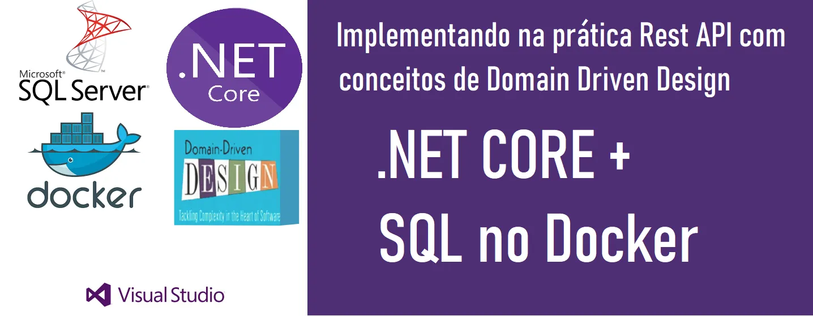
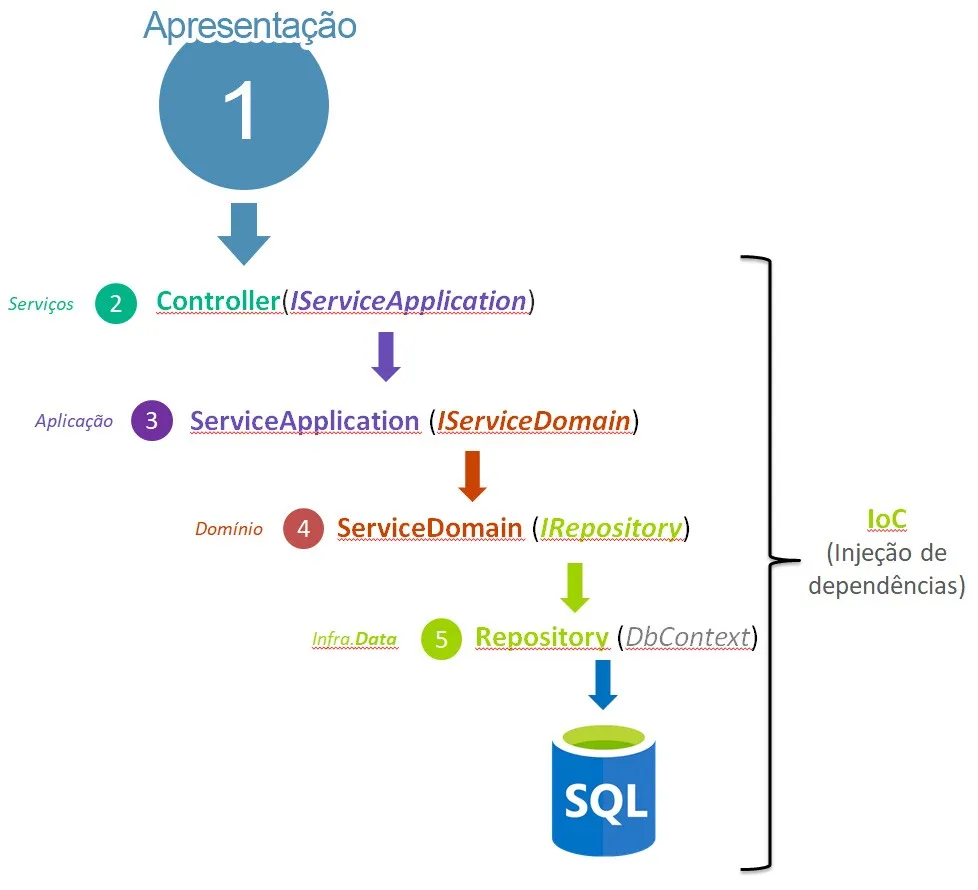

# DDD API Example



## Arquitetura em Camadas


## Comandos
```bash
## configuração do SQL Server no Docker
docker run -e 'ACCEPT_EULA=Y' -e 'MSSQL_SA_PASSWORD=yourStrong(!)Password' -p 1433:1433 --name sql1 --hostname sql1 -d mcr.microsoft.com/mssql/server:2022-latest

# Criar novos projetos na mesma solution
### projeto classlib
dotnet new classlib -n <nome_do_projeto>
### projeto webapi
dotnet new webapi -n <nome_do_projeto>

# Adicionar referencias de projeto num csproj
### entrar no csproj a ter referencia adicionada
dotnet add reference <path_referencia>

### adicionar package do NuGet como referencia
dotnet add package <nome_do_package>
```
