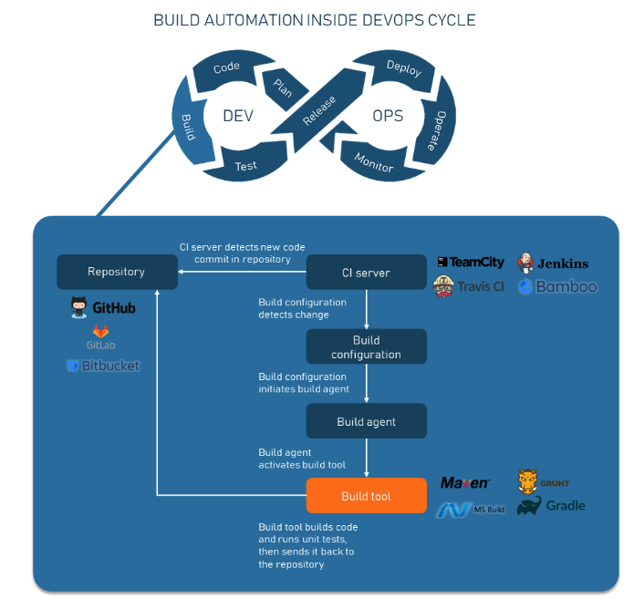

# CONTINUOUS DELIVERY - IN THE ENTERPRISE

## SUMMARY

- [x] 1. In the Enterprise
- [x] 2. CI/CD Pipelines
- [x] 3. Lean Startup
- [x] 4. VMs Exercises
- [x] 5. IaaC Concepts
- [x] 6. Development Environments
- [x] 7. Build Automation
- [x] 8. Cloud Computing
- [x] ==== Practical Classes ====

## 1. IN THE ENTERPRISE

### To know a little bit about us

### DevOps

1. What is DevOps?

```word
DevOps is a set of practices, tools, and a cultural philosophy that automate and integrate the processes between software development and IT teams. It emphasizes team empowerment, cross-team communication and collaboration, and technology automation
```

2. What is the Enterprise Architecture?

```word
Happens on every organization
```

**References**

- [1] https://www.techtarget.com/searchcio/definition/enterprise-architecture
- [2] https://www.cio.com/article/222421/what-is-enterprise-architecture-a-framework-for-transformation.html

2. What is the Software Development Life Cycle?

3. What is the Agile Manifesto and its Principles?

### SCRUM (framework)


### Vagrant

- Ubuntu 22.04.3 LTS

```bash
# Search for builds
https://app.vagrantup.com/boxes/search

# Adds a box with the given address to Vagrant
vagrant box add marcelobaptista/ubuntu2204

# Initializes the current directory to be a Vagrant environment by creating an initial Vagrantfile if one does not already exist
vagrant init marcelobaptista/ubuntu2204

# Installs a plugin with the given name or file path
vagrant plugin install vagrant-vbguest

# Start Vagrant instance
vagrant up

# access the command line interface of the vagrant instance
vagrant ssh

# Get out of VM
exit

# Stop the VM
vagrant halt

# Destroy VM
vagrant destroy
```

- Fedora 39

```bash
# Search for builds
https://app.vagrantup.com/boxes/search

# Adds a box with the given address to Vagrant
vagrant box add fedora/39-beta-cloud-base

# Initializes the current directory to be a Vagrant environment by creating an initial Vagrantfile if one does not already exist
vagrant init fedora/39-beta-cloud-base

# Installs a plugin with the given name or file path
vagrant plugin install vagrant-vbguest

# Start Vagrant instance
vagrant up

# Access the command line interface of the vagrant instance
vagrant ssh

# Get out of VM
exit

# Stop the VM
vagrant halt

# Destroy VM
vagrant destroy
```

**Bibliographical References**

- [1] Docs: https://developer.hashicorp.com/vagrant/docs/cli

## 2. CI/CD PIPELINES

### Software Development Life Cycle (SDLC)

### Continuous Integration

- Implementation Examples
  => Github
  => GitLab
  => Gitflow
  => Jenkins
  => Amazon Pipeline
  => Vagrant
  => Dagger ([1])

### Continuous Delivery x Continuous Deployment

- Considered on process
- Critical to the product
  => should be monitored

### CI / CD Pipeline

**References**

- [1] https://dagger.io
- [2] Accelerate: The Science of Lean Software and Devops: Building and Scaling High Performing Technology Organizations, by Nicole Fosgren, Jez Humble & Gene Kim
- [3] Continuous Delivery: Reliable Software Releases through Build, Test, and Deployment Automation (Addison-Wesley Signature Series (Fowler))
- [4] Modern Software Engineering: Doing What Works to Build Better Software Faster

## 3. CONTINUOUS DELIVERY

### Definition

**Definition**
The First Principle of Agile Manifesto
Working so that Our Software is Always in a Releasable State
A Logical Extension of Continuous Integration
A Holistic Approach to Software Development
Every commit gives birth to a release candidate


### The Lean Startup


### Bibliographical References

- [1] https://www.startuplessonslearned.com/2009/08/minimum-viable-product-guide.html

## 4. VIRTUAL MACHINES

```powershell
ubuntu

# Vagrant folder
cd /mnt/c/Users/Alexandre\ Pedro/Desktop/DEV_Bootcamp/Classes/Continuous_Delivery/virtualmachines/vagrant

# Multiply terminals
tmux

# Reaload machine
vagrant reload

# for Ubuntu
ssh -i ~/.vagrant.d\insecure_private_key -p 2222 vagrant@localhost
```

## 5. IaaC CONCEPTS


### 5.1 OSI Model


### Bibliographical References

- [1] https://www.youtube.com/watch?v=Xl62gQpAl1w

## 6. DEVELOPMENT ENVIRONMENTS

### Requirements

- Easily reproducible
- Replicate it fast (for all the team)
- Need to be shared in a VCS
- Needs to be created using EaC (Environment as Code)

### Docker Architecture


### Bibliographical References

- [1] Development Containers - https://containers.dev/
- [2] Dev Container - https://code.visualstudio.com/docs/devcontainers/tutorial
- [3] Rancher Desktop - https://rancherdesktop.io/
- [4] Jetbrains Dev Containers - https://www.jetbrains.com/help/idea/connect-to-devcontainer.html
- [5] Docker file definition - https://docs.docker.com/reference/dockerfile/

## 7. BUILD AUTOMATION

### Build automation inside DevOps cycle



**Deployment Pipeline**


### Using SonarQube

```code
docker run -d --name sonar -p 9000:9000 sonarqube:lts-community
```

### Bibliographical References

- [1] Deployment Pipeline_part 1 - https://www.pagerduty.com/resources/learn/what-is-a-deployment-pipeline/
- [2] Deployment Pipeline_part 2 - https://www.browserstack.com/guide/deployment-pipeline
- [3] Watchtower Container - https://containrrr.dev/watchtower/
- [4] SonarQube Scan Action - https://github.com/SonarSource/sonarqube-scan-action
- [5] Github Actions, Docker Compose and Watchtower - https://medium.com/@avash700/ci-cd-made-easy-github-actions-docker-compose-and-watchtower-60a698d24f27

## 8. CLOUD COMPUTING

### What is Cloud Computing?


### Bibliographical References

- [1] Top 10 Features of Cloud Computing in 2023 - https://cyfuture.cloud/blog/top-10-features-of-cloud-computing-features-in-2023/
- [2] What is Cloud Computing? - https://www.veritis.com/blog/what-is-cloud-computing/
- [3] What is Cloud Computing? - https://azure.microsoft.com/en-us/resources/cloud-computing-dictionary/what-is-cloud-computing

## ==== PRACTICAL CLASS ====

```bash
# Log on VM
vagrant ssh

# Export a file
mkdir tmp
cd tmp
echo "Hello Linux" > index.html

# At Ubuntu/Fedora
sudo python3 -m http.server 80

#  At other Linux versions
sudo python -m http.server 80

# IP address
ip a

# check firewall
sudo systemctl status firewalld

fuser -k 80/tcp

# enable firewall
firewall-cmd --zone=public --add-port=80/tcp --permanent

# reload
sudo firewall-cmd -- reload

# execute modification on VM
vagrant provision

# execute modification only in one part
vagrant provision [vm-name] --provision-with [provision_part]
Ex: vagrant provision agent-1 --provision-with shell

# install docker
vagrant plugin install vagrant-docker-composevagrant plugin install vagrant-docker-compose

# Enter jenkins
sudo su - jenkins

mkdir agent-folder

curl -sO http://192.168.56.10:8080/jnlpJars/agent.jar

mv agent.jar agent-folder

# Generate public SSH Key
ssh-keygen -t rsa -b 2048 -C "your_email@example.com"
ssh-keygen -t ed25519 -C "your_email@example.com"

# Access Azure machine (VM)
ssh pedro@57.151.89.230 -i YOUR_PRIVATE_KEY

# Install Docker Engine on Ubuntu
https://docs.docker.com/engine/install/ubuntu/

# Know Docker is Running
sudo systemctl status docker

# Monitoring the logs
sudo journalctl -udocker -f

# Add a user to the "docker" group on a Linux system
sudo gpasswd -a username docker

# Watchtower
docker run -d \  --name watchtower \  -e REPO_USER=jalauni-bootcamp-1@outlook.com \  -e REPO_PASS=dckr_pat_OCIEtKbyz4oWLARsFetoFst2JFg \  -v /var/run/docker.sock:/var/run/docker.sock \  containrrr/watchtower --debug

# Permissions
# permissions of the /opt/bootcamp directory and all its contents to read, write, and execute for the owner and the group, and read and execute for others
chmod 775 -R /opt/bootcamp

```

**Bibliographical References**

- [1] https://github.com/hashicorp/vagrant/wiki/Available-Vagrant-Plugins
- [2] https://github.com/leighmcculloch/vagrant-docker-compose
- [3] Jenkins: https://www.jenkins.io/doc/book/pipeline/jenkinsfile/
- [4] Excalidraw: https://excalidraw.com/#room=5ff45fae60335fbaf4a8,trkJRvblYGtryRCHP5sixw
